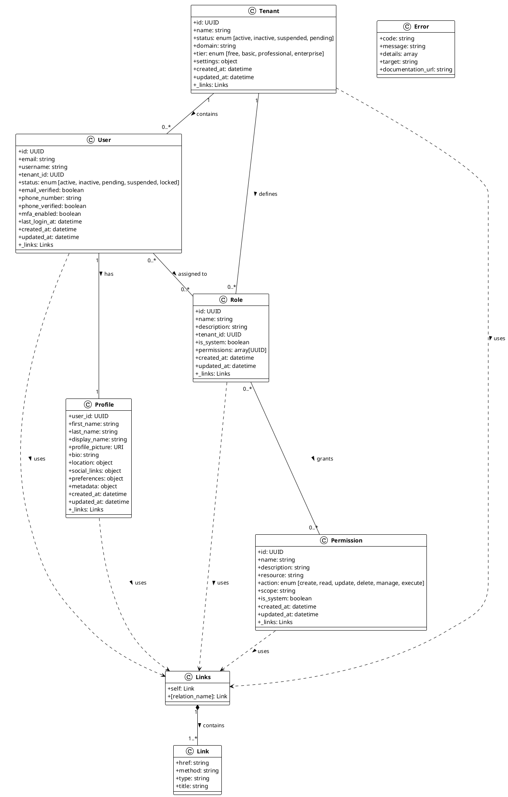

# Multi-Tenant User Identity and Profile API Schema

## UML Class Diagram



## Key Entity Relationships

### Core Entities
1. **Tenant**: Represents an organization or customer that uses the system
2. **User**: Represents a user within a tenant with authentication properties
3. **Profile**: Contains extended user information and preferences
4. **Role**: Defines a set of permissions for role-based access control
5. **Permission**: Defines granular access rights to system resources

### Relationship Highlights
- **Multi-Tenancy**: Each tenant contains multiple users and roles
- **User-Profile**: Each user has exactly one profile with extended information
- **RBAC**: Users have roles which grant specific permissions
- **HATEOAS**: All entities include hypermedia links for API navigation

## Nested Resource Hierarchy
```
Tenant
├── Users
│   ├── Profile
│   └── Roles
└── Roles
    └── Permissions
```

## Schema Features
- **UUID Identifiers**: All entities use UUID format for IDs
- **Timestamp Tracking**: Created/updated timestamps on all entities
- **Stateful Resources**: Status fields track lifecycle states
- **Soft Delete**: Entities support soft delete operations
- **Extensible**: `metadata` fields allow for custom attributes
- **HATEOAS Controls**: Every resource includes `_links` for discoverability

This diagram illustrates the clean separation of concerns and logical relationships between entities in your API schema, following industry best practices for multi-tenant user management systems.
