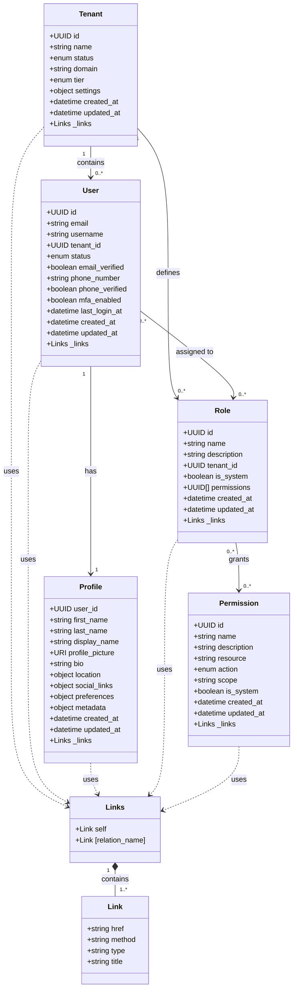

# API Schema Diagram (Mermaid)

## Schema Relationship Details

### Multi-Tenant Architecture
- The system follows a multi-tenant design where each tenant represents an organization
- Tenants act as containers for users, roles, and associated permissions
- Each user belongs to exactly one tenant, but a system user could potentially manage multiple tenants

### Identity and Profile Separation
- User objects contain authentication and identity information
- Profile objects store personal information and preferences
- This separation allows for flexible profile data without affecting core identity

### RBAC (Role-Based Access Control)
- Users are assigned to roles
- Roles contain collections of permissions
- Permissions define granular access rights to specific resources
- This allows for fine-grained access control and privilege management

### HATEOAS Implementation
- All resources include hypermedia links through the `_links` property
- Links provide navigational information for API clients
- This enables API discoverability and decouples clients from specific endpoints

### Data Integrity Features
- All entities use consistent UUID identifiers
- Creation and modification timestamps track resource history
- Status fields enable state management (active, inactive, etc.)
- System flags identify built-in entities that should not be modified
